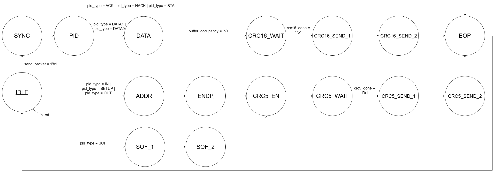
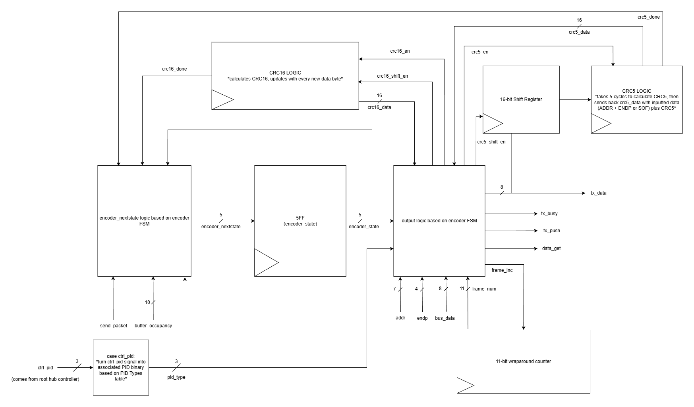
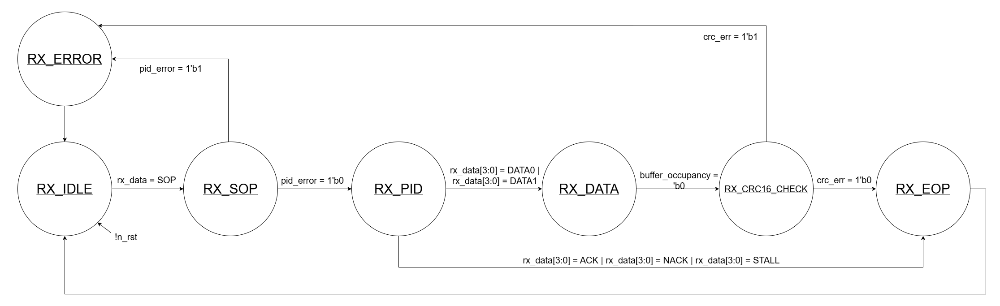
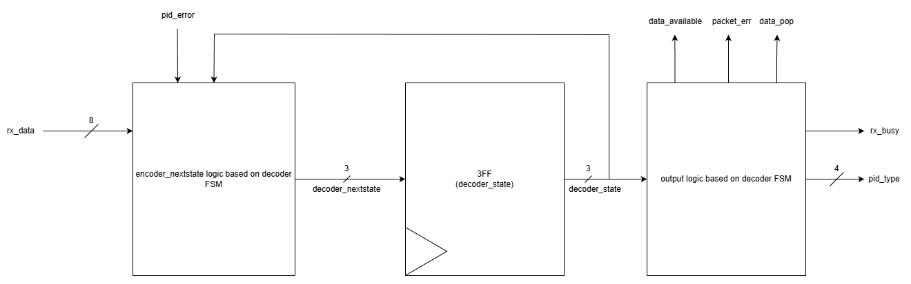

# Summary

USB Host RTL + Software Driver/Tools

Github Link: https://github.com/Purdue-SoCET/usb-host/tree/main 

Hardware Drive Link: https://drive.google.com/drive/folders/17cq7nKmZlmTFGAizIZR8e7hjxriKaKzu?usp=sharing 

Protocol Engine: 

The protocol engine is used to ensure that the host controller can properly receive and send packets that correctly follow the USB 1.1 protocol. This includes correctly sending and processing the SYNC and EOP (end-of-packet) sections found at the start and end of each packet, as well as calculating CRC bits for token, SOF (start-of-frame), and data packets.  The protocol is split into both an encoder end to handle TX transactions and a decoder end to handle RX transactions. 

Protocol Engine Encoder State Transition Diagram: 

Protocol Engine Encoder RTL: 

 

Protocol Engine Decoder State Transition Diagram: 

Protocol Engine Decoder RTL: 

Note that a lot of these flags in the RTLs can be added and/or removed, given that the protocol engine is very interconnected with the root hub controller. Thus, the RTL can be changed to fit the controller's functionality. 