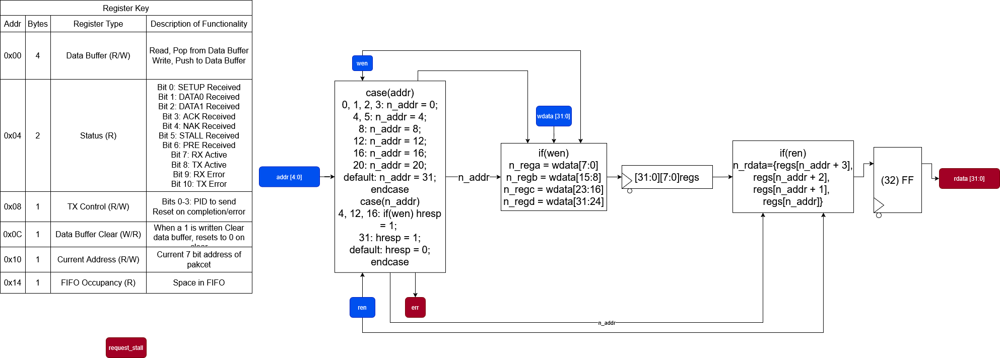
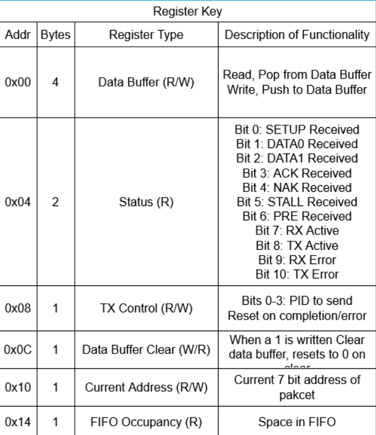

# USB Serializer

### RTL Diagram & State Machine Diagram

## I/O

| Port Name   | I/O    | Type    | Desctiption |
| ----------- | ------ | ------- | --------------- |
| clk         | Input  | logic   | Clock
| nrst        | Input  | logic   | Async Active-low Reset |
| addr          | Input  | logic[4:0]  | address of r/w |
| wen         | Input  | logic  | write enable |
| ren | Input | logic | read enable |
| err     | Input  | logic   | error signal |
| wdata | Output  | logic[31:0]   | write data |
| rdata | Input  | logic[31:0]   | read data |

