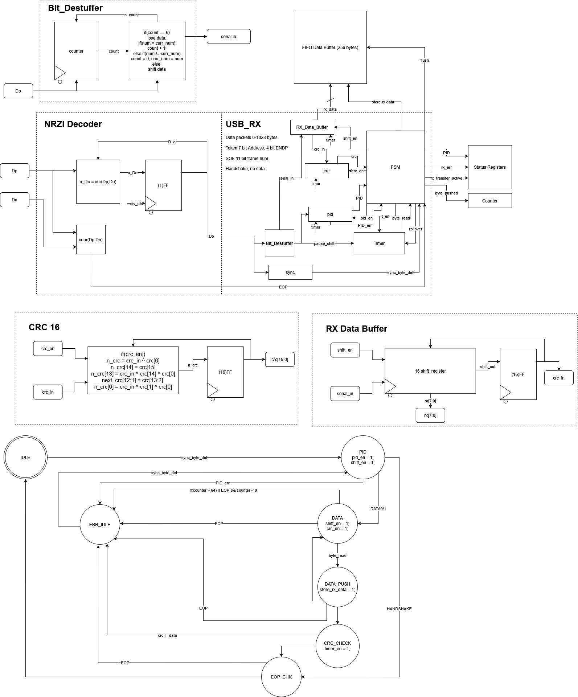

# USB Serializer

### RTL Diagram & State Machine Diagram

## I/O

| Port Name   | I/O    | Type    | Desctiption |
| ----------- | ------ | ------- | --------------- |
| clk         | Input  | logic   | Clock
| nrst        | Input  | logic   | Async Active-low Reset |
| Dp          | Input  | logic  | Input line of D-positive |
| Dn          | Input  | logic  | Input line of D-negative |
| rx_data | Input | logic[7:0] | Byte from RX to data buffer |
| store_rx_data     | Input  | logic   | Informs data buffer to store rx_data |
| rx_transfer_active | Output  | logic   | Signal for APB that informs on transfer actviity |
| flush        | Input  | logic   | The 4-bit code of the packet to be sent, triggers transfer start |
| PID        | Output  | logic[3:0]   | Output PID recieved |
| byte_pushed   | Output  | logic   | Used for counter counting for packet size |
| rx_err        | Output  | logic   | Error signal |

## State Diagram

| State        | Desctiption                 |
| ------------ | --------------------------- |
| IDLE         | Starting state, reset state |
| PID          | Send PID                    |
| DATA         | Load current FIFO byte      |
| DATA_PUSH    | Send each bit individually after encoding + bit stuffing |
| CRC_CHECK    | Load first byte of Token/SOF packet |
| EOP_CHK      | Send each bit of the first byte individually after encoding + bit stuffing |
| ERR_IDLE     | Load second byte of Token/SOF packet |
