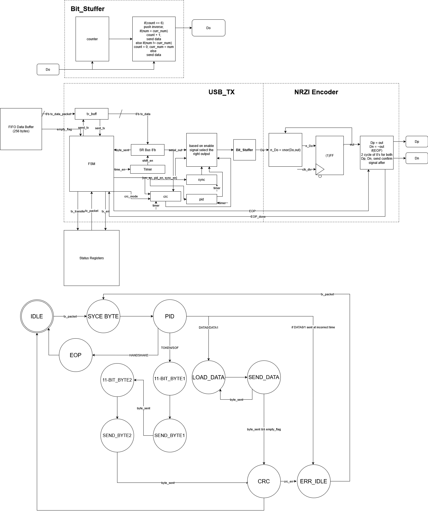

# USB Serializer

### RTL Diagram & State Machine Diagram

## I/O

| Port Name   | I/O    | Type    | Desctiption |
| ----------- | ------ | ------- | --------------- |
| clk         | Input  | logic   | Clock
| nrst        | Input  | logic   | Async Active-low Reset |
| Dp          | Output | logic  | Output line of D-positive |
| Dn          | Output | logic  | Output line of D-negative |
| tx_data_packet | Input | logic[7:0]   | Byte from data buffer to be sent |
| empty_flag     | Input  | logic   | Data Buffer signal to let TX know its empty |
| tx_transfer_active | Output  | logic   | Signal for APB that informs on transfer actviity |
| tx_packet        | Input  | logic[3:0]   | The 4-bit code of the packet to be sent, triggers transfer start |
| tx_err        | Output  | logic   | Error signal |

## State Diagram

| State        | Desctiption                 |
| ------------ | --------------------------- |
| IDLE         | Starting state, reset state |
| SYNC BYTE    | Sending a sync byte         |
| PID          | Send PID                    |
| LOAD_DATA    | Load current FIFO byte      |
| SEND_DATA    | Send each bit individually after encoding + bit stuffing |
| 11-BIT-BYTE1 | Load first byte of Token/SOF packet |
| SEND_BYTE1   | Send each bit of the first byte individually after encoding + bit stuffing |
| 11-BIT-BYTE2 | Load second byte of Token/SOF packet |
| SEND_BYTE2   | Send each bit of the first byte individually after encoding + bit stuffing |
| CRC          | Send the 5/16 bit CRC |
| ERR_IDLE     | Mimics idle except error goes high |